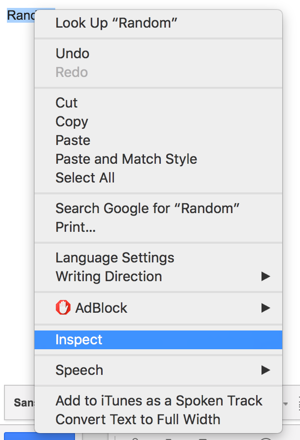

## How to create a customised HTML Email EDM for newbies xD

Hi there! Welcome to the readme guide to editing & customising an Electronic Digital Mail (EDM).

- - -

### Software to edit and customise the HTML file

> First & foremost, `Download & Install` either [Atom](https://atom.io/) or [Sublime Text](https://www.sublimetext.com/) editor before proceeding. These are editors powered with syntax highlighting abilities to make your code editing life easier.


### Steps to download the HTML file template

> 1. Download the template code from [EDM Template @ Github](https://github.com/Candiie/HTML-Email) - it will be in a zip file.

> 2. Unzip the folder & retrieve the `edm.html` file.

> 3. Drag the `edm.html` file into your installed text editor.


```
Continue reading if you're new to HTML code editing.
Otherwise happy coding :)

Scroll to the bottom for instructions on how to embed the written HTML code
into a email client for sending
```

- - -
- - -

### Important Do (s) & Don't (s)

Before proceeding to edit the code. There are some portions of code that can be freely customised and some that **should never be remove or edited**, below are some instructions to note.

> Codes labeled within `START - DO NOT EDIT CONTENT - START` & `END - DO NOT EDIT CONTENT - END` - **should never be edited**.

> Codes labeled within `START - EDIT CONTENT FREELY - START` & `END - EDIT CONTENT FREELY - END` - can be edited freely.

> Tags that looks like `#XXXXXX` are hexa color codes and ***can be edited freely within the entire code to your liking*** - e.g. by changing a code from `#FFFFFF` to `#DE6C9E` will result in the affected element to become light pink.

> When editing writings in codes in between tags, note to only edit the text in white. <br/>


- - -

### Steps to edit the HTML file template (Basic Content Editing)

Before we begin editing, double click the "edm.html" it should open up in chrome (preferred) or other web browser and look something like the image below. <br/>


Assuming that the only contents you'll be seeking to add & edit are the images, names & profile description and links. Below are sub topics and instructions to edit those elements mentioned above.

It is advisable for entry level coders to not edit too much of the code. However feel free to trail & error, after all you'll learn more from experimenting then only editing restricted contents.

#### Adding / Replacing the Content Title
The `main content title` of the entire edm can be edited to your desire.


> 1. Look for the code snippet below.
```
<!-- **************************************** -->
<!-- ******* MAIN EDM TITLE - EDIT ME ******* -->
<!-- **************************************** -->
```

> 2. The code snippet should look similar to the image below.


> 3. Feel free to `edit` the text in white - `ONLY the text in white` if you are a new to HTML.

#### Adding / Editing a section heading

To add a section heading above a section of introductions - like the bottom image.


> 1. Look for the code snippet below.
```
<!-- **************************************** -->
<!-- INTRO SEGMENT START - ADD TITLE ABOVE ME -->
<!-- **************************************** -->
```


> 1. Look for the code snippet below.
```
<!-- **************************************** -->
<!-- INTRO SEGMENT START - ADD TITLE ABOVE ME -->
<!-- **************************************** -->
```

```
<tr>
  <h1 style="margin: 10px 0 10px 0; font-family: sans-serif; font-size: 20px; line-height: 24px; color: #333333; font-weight: bold; text-align: middle;" >

  Singapore Design Team

  </h1>
  <hr style="width:100%; max-width:617.5px; opacity: 0.2"/>

 </tr>
 ```

> 3. .


#### Adding / Replacing the Profile Image
> 1. .

> 2. .

> 3. .

#### Editing the Name & written profile description
> 1. .

> 2. .

> 3. .

#### Adding / Editing a link
> 1. .

> 2. .

> 3. .

- - -
- - -

### Steps to embed the completed HTML code into an email

The following example is done via Chrome and Gmail, similar results can be reproduce in other web browsers.

> 1. Copy [ctrl + a & ctrl + c] the completed HTML code .

> 2. Proceed to your email client & open up your "New Message" window.


> 3. In the content field, `type a random string` of character.


> 4. `Double click on the string` to select it.


> 5. `Right click` & `select inspect` from the dropdown list.


> 6. On the opened debugging console (see below),


> 7. click on the ">" highlighted line of code to dropdown.


> 8. Select the portion of the code where your string lies - in this case i'm selecting the line that consist the word *"Random"*


> 9. Right click on the highlighted line/text and select `Edit as HTML`.


> 10. Remove the temporary string of character. <br/>


> 11. Paste [ctrl + v] the entire copied HTML code into the same field.


> 12. Click another unselected line in the console to close the editor.


> 13. Wahlah! the customised EDM should now appear on your "New Message" Window. Trying sending it to yourself or another email you can access to view the results.


*Notes from author* - This marks the end of the guide! Hope you've found it useful! Feel free to suggest changes and edits.


### Credits

Original & Various other HTML Email Templates can be found at `` http://tedgoas.github.io/Cerberus/ ``
